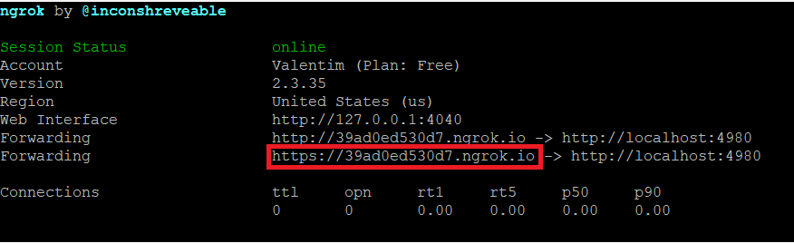
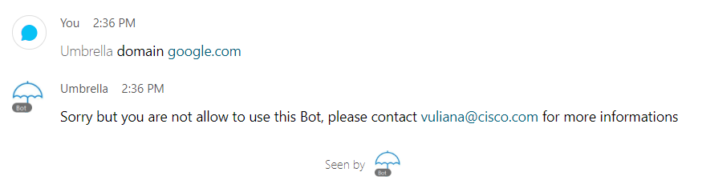

# Cisco Umbrella Investigate & Reporting Webex Teams Bot

Este repositório contém um script em Python que cria um Bot no Webex Teams integrado ao Cisco Umbrella Investigate & Reporting. Para executar este script, você precisa de uma [conta de desenvolvedor](https://developer.webex.com/docs) do Webex</a> e seguir <a href = "https://developer.webex.com/docs/bots" target="_blank">esta documentação</a> para criar um bot.

Este script usará uma sala no Webex Teams para registrar todas as mensagens enviadas e recebidas do seu Bot. Portanto, você precisará criar uma sala no Webex Teams e incluir seu Bot nela. Use esta <a href = "https://developer.webex.com/docs/api/v1/rooms/list-rooms" target="_blank"> chamada de API</a> para encontrar o roomId.

Um token de acesso <a href="https://docs.umbrella.com/investigate-api/docs/about-the-api-authentication" target="_blank">Cisco Umbrella Investigate API</a> também é necessário para execução do script.

API key e API secret do <a href="https://docs.umbrella.com/umbrella-api/docs/authentication-and-errors">Cisco Umbrella Management API</a> também é necessário para execução do script.

O Id da sua Organização do Umbrella também é necessário para execução do script! Use <a href = "https://docs.umbrella.com/deployment-umbrella/docs/find-your-organization-id" target="_blank">esta documentação</a> para saber como pegar seu Organization ID.

Como o Webex Teams é uma solução em nuvem, por segurança, ele trabalha com controle de acesso! No arquivo de configuração edite os domínios de emails autorizados para enviar mensagem ao Bot! 
<b> ex: cisco.com, gmail.com</b>

Este repositório contém um ícone do Umbrella para o seu bot, <a href="https://raw.githubusercontent.com/ValentimMuniz/Webexs-Tems-Umbrella-Investigate-Reporting-BOT/main/screenshots/umbrella.png">umbrella.png </a> 

Certifique-se de adicionar seu WebHook usando https://developer.webex.com/docs/api/v1/webhooks/create-a-webhook. Caso queira fazer um com um servidor local, recomendo que use o <a href = "https://ngrok.com/"> Ngrok </a>, uma ferramenta execente para fazer "forwarding" de portas em serviços HTTP.</a>  
Exemplo de uso: Pege a URL que está fazendo "forwarding" no Ngrok e coloque no <b>targetUrl</b>, na criação do WebHook do Webex Teams. 
   

<b> OBS: COMO O BOT ESTÁ EM UM GRUPO, ELE DEVE SER MENCIONADO @ PARA QUE AS MENSAGENS SEJAM TROCADAS<b><b>
  
# Arquivo de configuração, modificar com seus dados e credenciais antes de rodar o script
   

# Controle de acesso do BOT
  

# Trocando mensagem com o BOT
  

# Lista de comandos disponíveis
  

# LISTAGEM do TOP domínios mundiais vistos pela Umbrella
